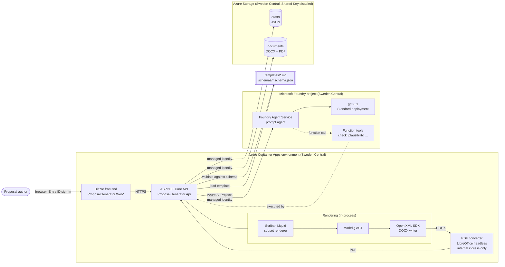

# ADR 0001: Architecture of the proposal generator

| | |
| --- | --- |
| Status | **Accepted** |
| Date | 2026-09-24 |
| Deciders | Repository owner (stack decision). This ADR records that decision, evaluates the alternatives and adds the template syntax contract. |
| Issue | #2 (epic #1, milestone M0) |
| Evidence | [`0001-poc/`](0001-poc/README.md): a standalone console proof of concept with executable self-checks |

## Context

The workshop demo is a commercial proposal generator. An agent on Microsoft Foundry (formerly Azure AI Foundry) collects data in a conversation. The generator then produces a Statement of Work (SOW), Request for Information (RFI), Request for Proposal (RFP), Master Service Agreement (MSA) or Change Request (CR) as Word (`.docx`) and PDF.

PR #45 provides five Markdown templates in `templates/` with YAML front matter. It also provides a field catalog in `templates/README.md` that uses Jinja2-style placeholders.

The owner fixed the stack before this ADR:

- .NET 9 and xUnit
- Foundry Agent Service via the official .NET SDK
- Open XML SDK, with Scriban (Liquid mode) and Markdig for templates
- LibreOffice headless for PDF
- ASP.NET Core API and Blazor on Azure Container Apps
- Bicep and azd
- keyless Entra ID authentication

This ADR records that decision and evaluates at least two options per decision area. It also fixes the one thing the owner left open, the template syntax, because Scriban does not interpret Jinja the way the templates assume. Finally it names what is still undecided.

### Decision drivers

1. **Workshop fit.** One language end to end, a short setup, and something participants can run and read in a day.
2. **EU data residency.** Customer and commercial data stay in the EU, both at rest and during processing.
3. **Keyless security.** Managed identity and `DefaultAzureCredential` only. No keys or secrets in the repository.
4. **Deterministic output.** The same data produces the same document. Rendering is testable offline without Azure.
5. **Licence and cost.** Open-source or Azure-native components, and consumption pricing that scales to zero between workshops.
6. **Support lifetime.** Components are supported for the lifetime of the demo.

## Decision

| Area | Decision |
| --- | --- |
| Agent platform | Microsoft Foundry Agent Service (the current, non-classic API) via `Azure.AI.Projects` 2.x, `Azure.AI.Projects.Agents` and `Azure.AI.Extensions.OpenAI`, with `Azure.Identity` |
| Model | `gpt-5.1`, Standard (regional) deployment in **Sweden Central**. The model name and SKU are azd parameters. |
| Runtime and language | .NET 9 (`net9.0`), C#, xUnit, as decided by the owner. **See risk R1: .NET 9 support ends on 2026-11-10.** |
| Word engine | Scriban 7.x in Liquid mode renders the template to Markdown. Markdig parses the Markdown to an AST, and the Open XML SDK 3.x writes the DOCX. Confirmed, with the amendments in [Template syntax subset](#template-syntax-subset-v1). |
| PDF conversion | LibreOffice headless (`soffice --headless --convert-to pdf`) in its own container, with `fonts-liberation` installed |
| Hosting | Azure Container Apps on the consumption plan: API, frontend, and the PDF converter as an internal-ingress app |
| Frontend | Blazor (ASP.NET Core) |
| Storage | Azure Blob Storage for generated documents and drafts. Shared Key access is disabled; access uses Entra ID RBAC only. The draft model remains open question Q3. |
| IaC | Bicep and Azure Developer CLI (`azd`) |
| Identity | User-assigned managed identity on the container apps and `DefaultAzureCredential` in code. RBAC is `Foundry User` (formerly named `Azure AI User`; [Foundry RBAC](https://learn.microsoft.com/azure/foundry/concepts/rbac-foundry)) on the Foundry project and `Storage Blob Data Contributor` on the storage account. |

## Architecture

`*` The frontend project name and whether it runs as its own container app are for the Repo & CI session (#4) to decide; see Q6.

Flow:

1. The agent collects the fields named in the template's `required_fields`, calls `check_plausibility` (a function tool that the API executes), and returns document JSON.
2. The API validates the JSON against `schemas/<doctype>.schema.json` and stores it as a draft.
3. On generation the API renders the template to Markdown with the subset renderer and converts it to DOCX in-process.
4. The API posts the DOCX to the internal PDF converter.
5. Both files are stored in Blob Storage.

The agent never renders documents. Rendering is deterministic code and needs no model call.

## Options considered

Costs are qualitative unless a figure is cited. Pricing pages change, so the linked source is authoritative. "Chosen" marks the owner's decision.

### 1. Agent platform

| Option | Rationale | Cost | Licence |
| --- | --- | --- | --- |
| **Foundry Agent Service, current API** (`Azure.AI.Projects` 2.0.1, `Azure.AI.Projects.Agents` 2.0.0, `Azure.AI.Extensions.OpenAI` 2.0.0) (chosen) | The managed agent runtime with server-side conversation state, function tools and file search. It is the API used by the current C# quickstart, and it matches the workshop story. | No separate agent fee; you pay for model tokens and for the tools and resources used, e.g. storage for the Standard setup | SDK: MIT; service: Azure terms |
| Foundry Agent Service, classic (`Azure.AI.Agents.Persistent` 1.1.0, Projects 1.x) | More samples exist, but it is **deprecated and retires on 2027-03-31**, so a new demo should not start on it | Same | MIT |
| Microsoft Agent Framework in-process (`Microsoft.Agents.AI.AzureAI`), calling a model deployment directly | Full control, easy offline fakes. But the .NET Foundry integration is **pre-release only** (1.0.0-rc5), and conversation state becomes our job. | Tokens only | MIT |
| Azure OpenAI Chat Completions or Responses directly, with hand-written tool loop | Fewest moving parts, but no agent-service story for the workshop, and we would re-implement tool orchestration | Tokens only | MIT |

Consequence: the agent layer is used behind an interface (for example `IProposalAgent`) so that tests use a fake and never call Azure, as the engineering rules require.

### 2. Model

Verified on Microsoft Learn on 2026-09-24; see [Model and EU availability](#model-and-eu-availability).

| Option | Rationale | Cost | Licence |
| --- | --- | --- | --- |
| **gpt-5.1** (chosen) | GA. Function tools and File Search are both marked supported by the Agent Service. Available as Standard regional in Sweden Central, and as Data Zone EU in France Central and Sweden Central. Retires 2027-05-15, after the workshop horizon. | Per-token ([pricing](https://azure.microsoft.com/pricing/details/cognitive-services/openai-service/)) | Microsoft Product Terms |
| gpt-4.1-mini | Cheapest model that supports both tools, and it is regional in Sweden Central and France Central. Deprecated, retiring 2027-04-14. Recommended as the cost fallback. | Lower per-token price | Same |
| gpt-5 / gpt-5-mini | Tools supported (gpt-5-mini: Functions is "No" in the tool table). Troubleshooting notes that gpt-5 models require registration. DZ EU only, with no Standard regional deployment in Sweden Central. | Per-token | Same |
| gpt-5.4 / gpt-5.5 / gpt-5.6-* | Newer and DZ EU available, but the Agent Service tool table marks Functions **No** for 5.4/5.5 and does not list 5.6. `check_plausibility` requires Functions, so they are rejected until Q7 is resolved. | Per-token | Same |

### 3. Runtime and language

| Option | Rationale | Cost | Licence |
| --- | --- | --- | --- |
| **.NET 9 (C#)** (chosen by the owner) | Official Foundry, Open XML and Identity SDKs; Blazor for a single-language UI; strong typing for schemas. **STS, end of support 2026-11-10** (R1). | Free | MIT |
| .NET 10 (C#) | Same stack, LTS, supported until 2028-11-14. It is the runtime installed on the build machine used for this ADR. **Recommended amendment** (Q1). | Free | MIT |
| Python 3 (FastAPI, python-docx / docxtpl, Jinja2) | Jinja2 would render the current templates unchanged. But the owner chose C#, and we would need a separate UI stack. | Free | PSF / MIT / LGPL-2.1 (docxtpl) |
| TypeScript (Node, docxtemplater) | Good for a web UI, but the Open XML story is weaker and the language is not the owner's choice | Free (docxtemplater core) / paid modules | MIT + commercial modules |

### 4. Word engine and template adaptation

| Option | Rationale | Cost | Licence |
| --- | --- | --- | --- |
| **Scriban (Liquid) → Markdown → Markdig AST → Open XML SDK** (chosen, confirmed with amendments) | Templates stay reviewable Markdown in Git. Deterministic, offline, and testable. Markdig gives a real AST (tables, lists, emphasis) instead of regex rewriting. Open XML SDK output validates against the Office 2019 schema; the PoC reached 0 errors. | Free | Scriban BSD-2-Clause, Markdig BSD-2-Clause, DocumentFormat.OpenXml MIT (licences read from the NuGet packages) |
| Placeholders in a designed `.docx` template, filled with the Open XML SDK (content controls or merge fields) | Best layout control, but templates become binary files and are hard to review in PRs. PR #45 already chose Markdown. | Free | MIT |
| Markdown → DOCX through Pandoc | High-quality conversion, but it needs a native binary in the container, and a GPL tool in the image | Free | GPL-2.0-or-later |
| Commercial SDK (Aspose.Words, Syncfusion DocIO) | Template engines, layout and PDF built in. Licence cost and key management conflict with the no-secrets demo; the issue leaves the question open (Q4). | Per-developer or per-deployment licence. Syncfusion has a community licence with eligibility limits. | Commercial |

Amendment: Scriban is used only through the subset below. Plain Liquid is insufficient: the measured defects are silent (see [Incompatibilities](#incompatibilities-found-in-the-pr-45-templates)).

### 5. PDF conversion

| Option | Rationale | Cost | Licence |
| --- | --- | --- | --- |
| **LibreOffice headless in a container** (chosen) | Converts DOCX to PDF with no licence cost. Runs as a separate internal container app, so the API image stays small and a crash cannot take the API down. | Free software; compute on ACA | MPL-2.0 |
| Gotenberg (`gotenberg/gotenberg:8`), which bundles LibreOffice behind an HTTP API | Same engine plus a ready-made HTTP API, queueing and timeouts. It is a good implementation of the chosen option; the choice is for #24 and #4. | Free; compute | MIT (wrapper) + MPL-2.0 |
| Microsoft Word automation (COM) or Microsoft Graph conversion | Highest fidelity for Word documents. COM is Windows-only and not supported for server use. Graph conversion needs the file in OneDrive/SharePoint and delegated tenant access, which does not fit the lab. | Microsoft 365 licence | Proprietary |
| Aspose.Words / Syncfusion PDF export | In-process with no extra container, but see Q4 | Commercial | Commercial |

### 6. Hosting

| Option | Rationale | Cost | Licence |
| --- | --- | --- | --- |
| **Azure Container Apps, consumption plan** (chosen) | Runs the custom LibreOffice container next to the API. Scales to zero, supports managed identity and internal ingress, and azd supports it directly. | Consumption. The first 180,000 vCPU-seconds, 360,000 GiB-seconds and 2 million requests per subscription per month are free ([pricing](https://azure.microsoft.com/pricing/details/container-apps/)). | Azure terms |
| Azure App Service for Containers | Mature and simple, but always-on plans cost money between workshops, and there is less natural multi-container isolation | Plan-based, no scale to zero | Azure terms |
| Azure Functions (Flex Consumption) | Good for the conversion step, but a poor fit for a long-running LibreOffice process and a Blazor UI | Consumption | Azure terms |
| AKS | Too much operational surface for a workshop | Cluster cost | Azure terms |

### 7. Frontend

| Option | Rationale | Cost | Licence |
| --- | --- | --- | --- |
| **Blazor** (chosen) | C# end to end, it shares DTOs with the API, and participants learn one language. Interactive Server render mode needs no separate SPA build. | Free | MIT |
| React / TypeScript SPA | Largest ecosystem and component libraries, but it adds a second toolchain to the workshop | Free | MIT |
| Microsoft 365 Copilot / Teams agent as the UI | Natural for a chat-first flow, but it needs a Microsoft 365 tenant and app registration, and download and preview are more complex. Candidate for a later epic. | M365 licensing | Proprietary |

The UI states and accessibility are defined by the design canvas (#31).

### 8. Storage for drafts and generated documents

| Option | Rationale | Cost | Licence |
| --- | --- | --- | --- |
| **Blob Storage for both**: `drafts/<id>.json` with ETag optimistic concurrency, `documents/<id>/<version>.{docx,pdf}` (chosen for the lab; Q3) | One resource and one RBAC role. Shared Key can be disabled so access is Entra ID only. Versioning and lifecycle rules handle retention. It is the cheapest option. | Per GB stored plus transactions | Azure terms; SDK MIT |
| Cosmos DB (serverless) for drafts, Blob for documents | Queryable drafts (list by author, status), but a second resource and data-plane RBAC to wire up | Serverless request units plus storage | Azure terms |
| Azure SQL Database for drafts | Relational queries, but schema migrations do not fit the draft JSON that already has a JSON Schema | vCore/DTU or serverless | Azure terms |
| Agent Service thread storage as the draft | No extra store, but it couples draft lifetime to agent threads. For residency the Standard setup already brings customer-owned Cosmos DB; we do not reuse it for application data. | Included | - |

### 9. Infrastructure as code

| Option | Rationale | Cost | Licence |
| --- | --- | --- | --- |
| **Bicep + azd** (chosen) | Azure-native, with no state file. `azd up` provisions and deploys the container apps in one command, which suits a workshop, and Azure Verified Modules are available. | Free | MIT |
| Terraform (azurerm) | Multi-cloud and a mature ecosystem, but it needs a state backend. Since 1.6 it uses the Business Source Licence. | Free CLI; state storage | BUSL-1.1 |
| OpenTofu | Terraform-compatible under an open-source licence, but the same state overhead and less azd integration | Free | MPL-2.0 |
| ARM JSON | Native, but verbose. Bicep compiles to it. | Free | - |

## Template syntax adaptation

### Incompatibilities found in the PR #45 templates

Method: the five templates at PR #45 head `bd9d90c` were parsed with `Scriban.Template.ParseLiquid` (Scriban 7.4.0) and rendered with a `LiquidTemplateContext`. Each rule below is implemented in [`SyntaxLint.cs`](0001-poc/SyntaxLint.cs). The self-check shows every rule firing on a known Jinja sample, so a zero count means "absent", not "undetectable". Command: `dotnet run -- lint ../../.. --details`.

**Key finding: all five templates parse with 0 Scriban errors.** A parse check therefore proves nothing. Every defect below is silent at parse time.

| Rule | Jinja construct | Scriban Liquid behaviour (measured) | CR | MSA | RFI | RFP | SOW | Total |
| --- | --- | --- | ---: | ---: | ---: | ---: | ---: | ---: |
| INC-01 | `{{ loop.index }}` | Renders **empty**, silently. The Liquid name is `forloop.index`. | 0 | 0 | 1 | 1 | 2 | 4 |
| INC-02 | `\| default("TBD")`, `\| join(", ")` | Accepted by Scriban's lenient parser, but not Liquid. The subset requires `\| default: "TBD"` and `\| join: ", "`. | 4 | 6 | 6 | 4 | 7 | 27 |
| INC-03 | `` | Parses without error, and **the branch silently renders nothing**. The Liquid keyword is `elsif`. | 0 | 0 | 0 | 0 | 0 | 0 |
| INC-04 | `{# comment #}` | Written to the output literally | 0 | 0 | 0 | 0 | 0 | 0 |
| INC-05 | `` as a presence test | `""` and `[]` are **truthy** in Liquid, while Jinja treats them as false. `0` is truthy in both engines. | 1 | 4 | 1 | 2 | 2 | 10 |
| INC-06 | Block tag on its own line (Jinja `trim_blocks`) | Liquid keeps the line break, so each tag leaves a blank line. Scriban has no `trim_blocks` option. | 7 | 0 | 6 | 14 | 20 | 47 |
| INC-06a | ... between Markdown table rows | The blank line **ends the Markdown table**: rows after the loop start render as paragraphs | 3 | 0 | 2 | 3 | 5 | 13 |
| INC-07 | `` whitespace control | Works in Scriban, but it is banned so that one mechanism (INC-06 rule) governs whitespace | 0 | 0 | 0 | 0 | 0 | 0 |
| INC-08 | `set`, `macro`, `is defined`, `~`, `and`/`or`/`not` | Not Liquid, or not in the subset | 0 | 0 | 0 | 0 | 0 | 0 |
| INC-09 | `[GUIDANCE: ...]` in the body | Plain text to Liquid, so it would be printed in the customer document | 1 | 1 | 1 | 1 | 0 | 4 |
| INC-10 | Any `{{ value }}` | No escaping. A value containing `\|` adds a table column, and `**x**` turns bold. | 40 | 26 | 29 | 36 | 61 | 192 |

Other measured behaviour relevant to authors:

- An unknown filter throws at render time, not parse time.
- `for` over null renders nothing.
- `default` also replaces an empty string.
- A double such as `0.1 + 0.2` renders as `0.30000000000000004`, while a decimal renders as written. Numbers are therefore never computed in templates.
- Under `StrictVariables` a missing top-level name throws, but a missing member of an existing object, or a member of null, renders empty.

Examples, with line numbers counted in the file:

- `sow.md:40` `{{ loop.index }}. {{ objective }}`
- `sow.md:71` `` between table rows
- `msa.md:27` `> [GUIDANCE: Template only, not legal advice. ...]`
- `change-request.md:28` ``

### Template syntax subset v1

This subset is **binding for template authors (#8, #9, #10, #11, #12) and the renderer (#24)**. It was sent to the coordinator on 2026-09-24. Anything not listed is not allowed. Extending the subset requires an amendment to this ADR.

**Authoring rules**

1. **Output**: `{{ a.b.c }}`, a dotted snake_case path with exactly one space inside the delimiters. Inside a loop `{{ forloop.index }}` gives the 1-based position. Not allowed: `loop.*`, arithmetic, indexing (`[0]`), and concatenation.
2. **Filters**: at most one per output, in Liquid colon syntax, with a literal argument:
   - `{{ x | default: "text" }}` or `{{ x | default: 10 }}`, which applies to null, missing or empty values;
   - `{{ list | join: ", " }}`.

   No other filters, and no parentheses.
3. **Loops**: `` … ``. No `limit`, `offset`, `reversed`, for-`else`, `break` or `continue`.
4. **Conditions**: ``, `` and ``, with `` (never `elif`), `` and ``. No `and`, `or`, `not`, `unless` or `contains`; nest `if` blocks instead.
5. **Comments**: `…` only.
6. **Whitespace**: every block tag that is not inline in a sentence stands on its own line, as the current templates already do. Do not use `` or `~`. A table-row loop is written as: header row, separator row, a `` line, **one** row line, then a `` line.
7. Every tag fits on one line.
8. **Top-level names**: `document`, `supplier`, `customer`, `project`, `pricing`, `legal`, `msa`, `sow`, `cr`, `rfi`, `rfp`. Any other root fails the render. These are the roots of the field catalog in `templates/README.md`.
9. **Guidance**: `[GUIDANCE: …]` markers are single-line with no nested `]`, and they are hints for authors and the agent. The renderer removes them. Text that must appear in the customer document, such as the MSA legal disclaimer, is written as normal text (see Q8).
10. **Values are plain text.** `default` literals and data must not contain Markdown formatting, and values used in table cells are single-line.
11. **Front matter**: `required_fields` lists dotted paths. A missing or null value, a blank string or an empty list rejects the document before rendering.
12. **No formatting in templates.** Numbers, currencies and dates render verbatim. Formatting belongs to the data layer (Q5).

**Renderer contract (#24).** Each rule is proven with a negative control in [`SelfCheck.cs`](0001-poc/SelfCheck.cs).

| # | Rule | Reference implementation |
| --- | --- | --- |
| R-a | Strip the YAML front matter. Normalise CRLF to LF. Remove every line that contains only one `` tag, together with its line break: multiline regex `^[ \t]*(\{%[^%\n]*%\})[ \t]*\n` → `$1`. | `SubsetRenderer.ApplyStandaloneTagRule` |
| R-b | Presence semantics: override `TemplateContext.ToBool` so that null, false, a blank string and an empty collection are false. Everything else is true, including `0`. | `SubsetTemplateContext.ToBool` |
| R-c | Markdown-escape **values only**: override `Write(SourceSpan, object)` to backslash-escape ``\ ` * _ [ ] < > | # & ~``, plus a leading `-`, `+`, `=`, `N.` or `N)`. Template text is never escaped. | `SubsetTemplateContext.Write`, `EscapeMarkdown` |
| R-d | Set `StrictVariables = true` and seed all eleven roots as null, so an absent object renders empty while a typo or `loop.*` fails. Set `LoopLimit = 1000`. | `SubsetRenderer.Render` |
| R-e | Check `required_fields` before rendering. | `SubsetRenderer.IsMissing` (called from `Render`) |
| R-f | Remove `[GUIDANCE: …]` after rendering: a whole line, including a `> ` prefix, or inline. | `GuidanceLineRegex` / `GuidanceInlineRegex` in `SubsetRenderer.Render` |
| R-g | Reject templates that violate the subset grammar in CI. | `SyntaxLint.FindSubsetViolations` |

**Migration of the PR #45 templates.** The migration is mechanical and is implemented in [`JinjaToSubset.cs`](0001-poc/JinjaToSubset.cs):

- `loop.` → `forloop.`
- `| default(X)` → `| default: X`
- `| join(X)` → `| join: X`
- `elif` → `elsif`

After it, all five templates show 0 subset violations, 0 parse errors and 0 remaining Jinja constructs, and a strict render with empty data passes. Before it they show 4 / 6 / 7 / 5 / 9 violations (CR / MSA / RFI / RFP / SOW).

The template owners apply the rewrite in their own files. The `templates/README.md` "Placeholder syntax" section (owner #7) must point to this subset instead of Jinja2.

## Model and EU availability

All sources were fetched on 2026-09-24. The page date is the page's `ms.date` metadata.

| Fact | Source |
| --- | --- |
| Deployment types: data at rest stays in the resource's geography in every type. **Global** may process anywhere. **Data Zone EU** processes only within EU member states. **Standard (regional)** processes in the deployment region. | [Deployment types](https://learn.microsoft.com/azure/foundry/foundry-models/concepts/deployment-types) (page date 2026-08-06) |
| Agent Service regions in Europe: France Central, Germany West Central, Italy North, Norway East, Poland Central, Spain Central, Sweden Central, Switzerland North/West, UK South, West Europe. Sweden Central and West Europe support all tools. Germany West Central supports all except Computer Use. Italy North has no File Search. | [Agent Service limits, quotas and regions](https://learn.microsoft.com/azure/foundry/agents/concepts/limits-quotas-regions) (page date 2026-09-07) |
| Tool support by model. Functions **and** File Search: gpt-4.1, gpt-4.1-mini, gpt-4o, gpt-4o-mini, gpt-5, gpt-5.1, gpt-5.2, o3, o4-mini. Functions "No": gpt-5-mini, gpt-5.3-chat, gpt-5.4, gpt-5.4-mini, gpt-5.5. Not listed: gpt-5.6-*, gpt-6-*. | same page |
| Agents (classic), the service behind `Azure.AI.Agents.Persistent`, "are now deprecated and will be retired on March 31, 2027" ([What's new, classic](https://learn.microsoft.com/azure/foundry-classic/agents/whats-new), page date 2026-09-10). The current C# quickstart uses `Azure.AI.Projects`, `Azure.AI.Projects.Agents` and `Azure.AI.Extensions.OpenAI`, with the endpoint `https://<resource>.services.ai.azure.com/api/projects/<project>`. | [Quickstart](https://learn.microsoft.com/azure/foundry/quickstarts/get-started-code) (page date 2026-09-03) |
| Retirement dates: gpt-4.1-nano 2026-10-14; o-series 2026-11-19; gpt-4o 2024-05-13 2026-12-09; gpt-5 / gpt-5-mini 2027-02-09; gpt-4.1 / gpt-4.1-mini / gpt-4o (08-06, 11-20) 2027-04-14; gpt-5.1 2027-05-15; gpt-5.2 2027-06-08; gpt-5.6-* 2028-01-11 | [Model retirement schedule](https://learn.microsoft.com/azure/foundry/openai/concepts/model-retirement-schedule) (page date 2026-09-21) |

Chat model availability by region and deployment type. Source: [Region availability for Foundry Models sold by Azure](https://learn.microsoft.com/azure/foundry/foundry-models/concepts/models-sold-directly-by-azure-region-availability) (page date 2026-09-03), Europe tables.

| Region | Standard (regional) | Data Zone Standard EU |
| --- | --- | --- |
| **Sweden Central** | gpt-4.1, gpt-4.1-mini, gpt-4o, gpt-4o-mini, **gpt-5.1**, o1, o4-mini | gpt-4.1, 4.1-mini, 4.1-nano, gpt-4o, 4o-mini, gpt-5, 5-mini, 5-nano, **gpt-5.1**, gpt-5.4, 5.4-mini, gpt-5.5, gpt-5.6-luna/sol/terra, gpt-6-luna/sol, o1, o3, o3-mini, o4-mini |
| Germany West Central | **No chat models** (text-embedding-3-large only) | Same list as Sweden Central, **without gpt-5.1** |
| France Central | gpt-4.1-mini, gpt-4o (2024-11-20) | Includes gpt-5.1 |

The EU Data Zone does not offer gpt-5.2.

**Recommendation: Sweden Central, gpt-5.1, Standard (regional) deployment.**

- Of the EU regions checked, Sweden Central is the only one with all three: every Agent Service tool (West Europe also has every tool), the widest Standard regional chat catalogue (7 chat models; France Central has 2, Germany West Central 0), and the full Data Zone EU catalogue including gpt-5.1.
- A Standard deployment keeps processing in the deployment region, which is stricter than Data Zone EU.
- Use Data Zone EU in the same region when Standard quota is insufficient, or when the owner picks a model that is DZ-only.
- **Germany West Central** is the alternative if data at rest must stay in Germany. It offers only Data Zone EU for chat models, and gpt-5.1 is not available there, so the model would change, for example to gpt-4.1 or gpt-5 (registration).
- Region, model, version and SKU are azd parameters (IaC #3), not code constants.
- For residency, the Agent Service uses the **Standard agent setup**, with customer-owned Storage, AI Search and Cosmos DB in the same region. The Basic setup stores agent data in Microsoft-managed storage. This is recorded in Q2.

## Proof of concept

The details are in [`0001-poc/README.md`](0001-poc/README.md).

Measured on 2026-09-24:

| Step | Result |
| --- | --- |
| Build (`TreatWarningsAsErrors`) | exit 0, 0 warnings |
| Self-check | exit 0. The renderer has 10 checks, 8 of them with a negative control that reinstates the defect and fails as expected. All 11 lint rules fire on known input. The subset grammar shows 7 violations for the Jinja sample and 0 for the subset sample. |
| Lint of the 5 templates | exit 0. The table above, and the migration result |
| SOW → Markdown → DOCX | exit 0. 23 headings, 6 tables, 8 lists; 135 paragraphs; **0 Open XML validation errors** (Office 2019). The first run found 8 schema errors, which were fixed; the gate can fail. |
| DOCX → PDF (LibreOffice) | **Not run: blocker.** `soffice` is not installed. `docker` is not recognised, and WSL is not installed. The exact command the PoC would run is `soffice -env:UserInstallation=file:///<tmp> --headless --norestore --convert-to pdf --outdir <out> <out>/sow.docx`. The PoC exits 2 with `--require-pdf`. |

**Observed layout fidelity.** The DOCX was rendered with Microsoft Word as a reference, not with LibreOffice.

- 3 A4 pages, all text in Arial.
- The table header rows repeat across page breaks.
- Values containing `|` and `*` stay literal inside their cells.
- Ordered lists restart for each list.
- The missing role name renders as `TBD`.

Findings for the renderer (#24) and the template owners:

- **F1.** Table columns are equal width, so an ID column takes 20 %. Derive widths from the content or a template hint.
- **F2.** The cached `NUMPAGES` field value appears until Word repaginates. PDF converters recompute it; do not rely on cached field text.
- **F3.** Enum codes such as `capped_tm` render raw. Templates map them to labels with `if`/`elsif`.
- **F4.** Numbers have no thousands separators (Q5).

The LibreOffice fidelity risk, Arial replaced by Liberation Sans, is expected to be small because the fonts are metric-compatible. It is **unmeasured** and becomes the first acceptance check for the PDF container (R3).

## Consequences

Positive:

- One language, and deterministic, offline-testable rendering. The agent only supplies JSON.
- Templates remain reviewable Markdown. A lint and a strict render catch syntax errors in CI instead of in a customer document.
- No licence cost, and keyless access throughout.

Negative:

- Layout is limited to what Markdown expresses: headings, paragraphs, lists, tables and emphasis. Logos, headers with images, multi-column layouts and custom table widths need renderer features or a reference `.docx` for styles.
- The subset is deliberately small: no boolean operators and no formatting. Some logic moves into the data layer or into nested `if` blocks.
- Custom Scriban context overrides (`ToBool`, `Write`) depend on Scriban internals, so a Scriban upgrade must re-run the renderer's contract tests.

### Risks

| ID | Risk | Mitigation | Owner |
| --- | --- | --- | --- |
| R1 | **.NET 9 reaches end of support on 2026-11-10** (STS, "Maintenance"; [.NET support policy](https://dotnet.microsoft.com/platform/support/policy/dotnet-core), "Last updated: September 8, 2026"). .NET 10 LTS is supported until 2028-11-14. The build machine has no .NET 9 runtime, so net9.0 runs only through `RollForward`. | Retarget to `net10.0` before M1 (Q1) | Repository owner, Repo & CI #4 |
| R2 | Models retire during the demo's lifetime (gpt-4.1: 2027-04-14; gpt-5.1: 2027-05-15) | Keep the model as an azd parameter and review the retirement page each milestone | IaC #3 |
| R3 | LibreOffice layout differs from Word, mainly through font substitution | Install `fonts-liberation`; make a page count and visual diff against a Word reference the PDF service's acceptance check | Renderer #24 |
| R4 | Template authors reintroduce Jinja constructs | Run the subset lint in CI; the renderer rejects violations | #24, #4 |
| R5 | Value escaping misses a Markdown construct that Markdig interprets | Property tests over the metacharacter list in #24, starting from the PoC checks | #24 |

## Open questions

| ID | Question | Owner | Default until decided |
| --- | --- | --- | --- |
| Q1 | Keep .NET 9 or move to .NET 10 LTS (R1)? | Repository owner, with Repo & CI #4 | .NET 9, as decided |
| Q2 | Which Azure subscription and region does the lab use? Is the Standard agent setup (customer-owned Storage, AI Search, Cosmos DB) acceptable for cost, or is the Basic setup enough for fictional data? | Repository owner, IaC & auth #3 / #5 | Sweden Central; Standard setup |
| Q3 | Draft storage: blob JSON per draft, or Cosmos DB? How long are drafts and generated documents kept, and who can see whose drafts? | Data model #7 with Repo & CI #4; retention with Data protection #41 | Blob JSON with ETag concurrency |
| Q4 | Is a commercial SDK (Aspose, Syncfusion) acceptable, as the issue asks? | Repository owner | No; open-source stack |
| Q5 | Number, currency and date formatting: which culture (de-DE vs en-GB), and does the schema carry display strings or does the renderer format? | Data model #7 with Renderer #24 | Values render verbatim |
| Q6 | Frontend project name and hosting: a separate container app or served by the API? | Repo & CI #4, Design #31 | Separate container app |
| Q7 | Do gpt-5.4, gpt-5.5 or gpt-5.6 support function tools in the Agent Service? The docs table says no or does not list them. Does gpt-5 registration apply to the lab subscription? | Agent #16 / #18, verify in the Foundry portal | gpt-5.1 |
| Q8 | The MSA disclaimer is written as `[GUIDANCE: …]`, so the renderer removes it. Should it appear in the generated MSA? | MSA #11 | Removed; if it must be kept, rewrite it as plain text |
| Q9 | The templates are English, and the backlog is German. Is German output needed? | Repository owner | English templates only |

## References

- Microsoft Foundry quickstart (C#): <https://learn.microsoft.com/azure/foundry/quickstarts/get-started-code>
- Agent Service limits, quotas and regions: <https://learn.microsoft.com/azure/foundry/agents/concepts/limits-quotas-regions>
- Deployment types: <https://learn.microsoft.com/azure/foundry/foundry-models/concepts/deployment-types>
- Model region availability: <https://learn.microsoft.com/azure/foundry/foundry-models/concepts/models-sold-directly-by-azure>
- Model retirement schedule: <https://learn.microsoft.com/azure/foundry/openai/concepts/model-retirement-schedule>
- Region availability for Foundry Models sold by Azure: <https://learn.microsoft.com/azure/foundry/foundry-models/concepts/models-sold-directly-by-azure-region-availability>
- Agents (classic) deprecation notice: <https://learn.microsoft.com/azure/foundry-classic/agents/whats-new>
- Foundry RBAC: <https://learn.microsoft.com/azure/foundry/concepts/rbac-foundry>
- .NET support policy: <https://dotnet.microsoft.com/platform/support/policy/dotnet-core>
- Container Apps pricing: <https://azure.microsoft.com/pricing/details/container-apps/>
- Scriban Liquid support: <https://github.com/scriban/scriban/blob/master/doc/liquid-support.md>
