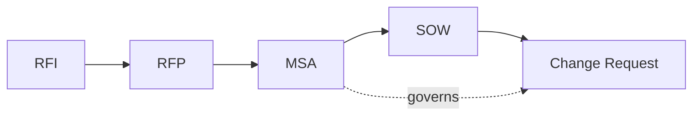

# Commercial document templates

Source templates for the commercial proposal generator. The Foundry agent collects the
data, and the generator merges it into these templates to produce Word (`.docx`) and PDF output.

> **Disclaimer:** These templates are starting points, not legal advice. Have qualified legal
> counsel review every clause before you use a generated document with a customer or supplier.

| Template | File | Purpose | Typical predecessor |
| --- | --- | --- | --- |
| Request for Information / Expression of Interest (RFI) | [rfi.md](rfi.md) | Gauge market interest and supplier capabilities without obligation | – |
| Request for Proposal (RFP) | [rfp.md](rfp.md) | Request binding, comparable proposals for a defined scope | RFI |
| Master Service Agreement (MSA) | [msa.md](msa.md) | Framework terms governing all future work between the parties | – |
| Statement of Work (SOW) | [sow.md](sow.md) | Scope, deliverables, schedule, and commercials of one engagement | MSA |
| Change Request (CR) | [change-request.md](change-request.md) | Controlled change to an agreed SOW | SOW |

## Placeholder syntax

Templates use [Jinja2](https://jinja.palletsprojects.com/)-compatible syntax, because Word
template engines such as `docxtpl` (Python) and `docxtemplater` (JavaScript) support it
natively or through adapters. The architecture decision in the backlog confirms the final engine.

| Construct | Example | Meaning |
| --- | --- | --- |
| Value | `{{ customer.name }}` | Insert a single field |
| Loop | ` … ` | Repeat for each list item, for example table rows |
| Condition | ` … ` | Include a section only when a condition holds |
| Guidance | `[GUIDANCE: …]` | Instruction for the author or agent; must be removed before release |

Each template starts with YAML front matter that lists `required_fields`. The generator must
reject a document when a required field is missing, rather than rendering an empty value.

## Shared field catalog

All templates share these objects, so the agent can reuse answers across document types.

| Object | Fields |
| --- | --- |
| `document` | `number`, `version`, `date`, `status` (`draft`, `in_review`, `final`), `language`, `confidentiality` |
| `supplier` | `name`, `legal_form`, `address`, `registration_number`, `vat_id`, `contact.name`, `contact.email`, `contact.phone`, `signatory.name`, `signatory.title` |
| `customer` | Same fields as `supplier` |
| `project` | `name`, `summary`, `background`, `objectives[]`, `start_date`, `end_date` |
| `pricing` | `model` (`fixed_price`, `time_and_materials`, `capped_tm`), `currency`, `total`, `rate_card[]`, `payment_schedule[]`, `expenses_policy`, `tax_note` |
| `legal` | `governing_law`, `jurisdiction`, `liability_cap`, `payment_terms_days`, `notice_period_days` |
| `msa` | `reference`, `date` (used by the SOW and change request to reference the governing agreement) |
| `sow` | `reference`, `date` (used by the change request) |
