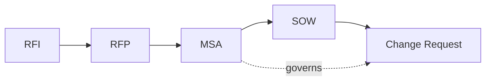

# Commercial document templates

Source templates for the commercial proposal generator. The Foundry agent collects the
data, and the generator merges it into these templates to produce Word (`.docx`) and PDF output.

> **Disclaimer:** These templates are starting points, not legal advice. Have qualified legal
> counsel review every clause before you use a generated document with a customer or supplier.

| Template | File | Purpose | Typical predecessor |
| --- | --- | --- | --- |
| Request for Information / Expression of Interest (RFI) | [rfi.md](rfi.md) | Gauge market interest and supplier capabilities without obligation | – |
| Request for Proposal (RFP) | [rfp.md](rfp.md) | Request binding, comparable proposals for a defined scope | RFI |
| Master Service Agreement (MSA) | [msa.md](msa.md) | Framework terms governing all future work between the parties | – |
| Statement of Work (SOW) | [sow.md](sow.md) | Scope, deliverables, schedule, and commercials of one engagement | MSA |
| Change Request (CR) | [change-request.md](change-request.md) | Controlled change to an agreed SOW | SOW |

## Placeholder syntax

Templates use [Jinja2](https://jinja.palletsprojects.com/)-compatible syntax, because Word
template engines such as `docxtpl` (Python) and `docxtemplater` (JavaScript) support it
natively or through adapters. The architecture decision in the backlog confirms the final engine.

| Construct | Example | Meaning |
| --- | --- | --- |
| Value | `{{ customer.name }}` | Insert a single field |
| Loop | ` … ` | Repeat for each list item, for example table rows |
| Condition | ` … ` | Include a section only when a condition holds |
| Guidance | `[GUIDANCE: …]` | Instruction for the author or agent; must be removed before release |

Each template starts with YAML front matter:

| Key | Meaning |
| --- | --- |
| `required_fields` | Dotted field paths the template cannot render without. The generator must reject a document when one is missing, rather than rendering an empty value. |
| `optional_fields` | Optional. Dotted field paths the template renders when present, typically with default text otherwise. Lets each template declare every placeholder it uses. |

Every path in either list must exist in the template's schema, and every `required_fields` path must be
required there at every level. `tests/ProposalGenerator.Schemas.Tests` enforces this. To add a field,
change the schema and the template in the same pull request.

## Field catalog

The JSON Schemas in [`../schemas/`](../schemas/) are the **source of truth** for field names, types,
and required fields. The table below is an overview only; if it disagrees with a schema, the schema wins.

| Document type | Template | Schema | Valid example |
| --- | --- | --- | --- |
| RFI | [rfi.md](rfi.md) | [rfi.schema.json](../schemas/rfi.schema.json) | [rfi.example.json](../schemas/examples/valid/rfi.example.json) |
| RFP | [rfp.md](rfp.md) | [rfp.schema.json](../schemas/rfp.schema.json) | [rfp.example.json](../schemas/examples/valid/rfp.example.json) |
| MSA | [msa.md](msa.md) | [msa.schema.json](../schemas/msa.schema.json) | [msa.example.json](../schemas/examples/valid/msa.example.json) |
| SOW | [sow.md](sow.md) | [sow.schema.json](../schemas/sow.schema.json) | [sow.example.json](../schemas/examples/valid/sow.example.json) |
| Change Request | [change-request.md](change-request.md) | [change-request.schema.json](../schemas/change-request.schema.json) | [change-request.example.json](../schemas/examples/valid/change-request.example.json) |

Shared definitions live in [`common.schema.json`](../schemas/common.schema.json) under `$defs`. The
valid examples form one fictional chain (RFI → RFP → MSA → SOW → CR) and can seed demos and tests.
[`../schemas/examples/invalid/`](../schemas/examples/invalid/) holds one broken copy per defect, and
`expected-errors.json` there names the field path and keyword each one must fail on.

| Object | Main fields (see the schema for types and required fields) |
| --- | --- |
| `document` | `type` (fixed per schema), `number`, `version`, `date`, `status` (`draft`, `final`), `language` (`de`, `en`), `confidentiality`, `created_by`, `approved_by`, `approved_at`, `references[]` (`type`, `number`, `version`, `date`) |
| `supplier`, `customer` | `name`, `legal_form`, `address` (`street`, `postal_code`, `city`, `region`, `country`), `registration_number`, `vat_id`, `profile`, `contact` (`name`, `role`, `email`, `phone`), `signatory` (`name`, `title`) |
| `project` | `name`, `summary`, `background`, `objectives[]`, `start_date`, `end_date` |
| `pricing` | `model` (`fixed_price`, `time_and_materials`, `capped_tm`), `currency`, `total`, `cap`, `rate_card[]`, `payment_schedule[]`, `expenses_policy`, `tax_note` |
| `legal` | `governing_law`, `jurisdiction`, `liability_cap` (`amount`, `currency`), `payment_terms_days`, `notice_period_days`, `term_years`, `acceptance_days`, `ip_model` (`licence`, `assignment`), `confidentiality_years`, `cure_period_days`, `dpa_reference` |
| `msa` | `reference`, `version`, `date` (in SOW, CR, and optionally RFP: the governing agreement) |
| `sow` | In the SOW: scope, phases, deliverables, milestones, roles, and governance. In the CR: `reference`, `version`, `date` of the amended SOW |
| `rfi`, `rfp`, `cr` | Type-specific content; see the schema |

### Value conventions

- **Amounts** are JSON numbers, never text: `184000`, not `"184000"`. Inside `pricing` and `cr.impact`
  they are in `pricing.currency`, which matches `{{ pricing.currency }} {{ pricing.total }}` in the
  templates. Elsewhere an amount is a money object `{ "amount": 250000, "currency": "EUR" }`.
- **Currencies** are ISO 4217 codes (`EUR`), **countries** ISO 3166-1 alpha-2 codes (`DE`), and **dates**
  ISO 8601 calendar dates (`2026-03-16`).
- **Enumerations** hold lowercase machine values (`fixed_price`, `must`, `add`). Templates render display labels.
- **Structured values** must be rendered by their parts: `{{ supplier.address.street }}`,
  `{{ legal.liability_cap.amount }} {{ legal.liability_cap.currency }}`.
- **Linking (#13):** `document.references[]` names every predecessor by type and number. The rendered
  `msa.reference`, `sow.reference`, and `rfp.rfi_reference` repeat those numbers.
- **Validators** must assert `format` (for example, `RequireFormatValidation` in JsonSchema.Net);
  otherwise an impossible date such as `2026-02-30` passes.
- The schema checks shape only. Cross-field rules belong to `check_plausibility`, for example: weights
  total 100, `subtotal = daily_rate × days`, `revised_value = original_value + cost`, end date not before
  start date, and party names and references match the predecessor document.
